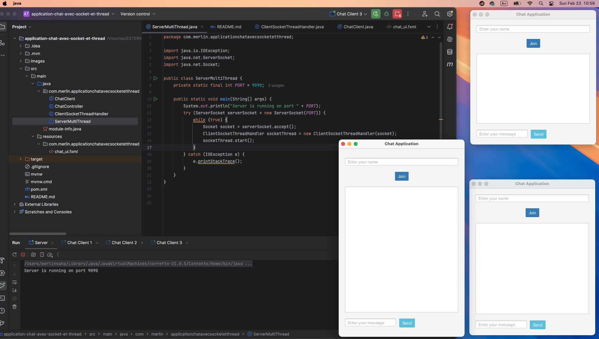
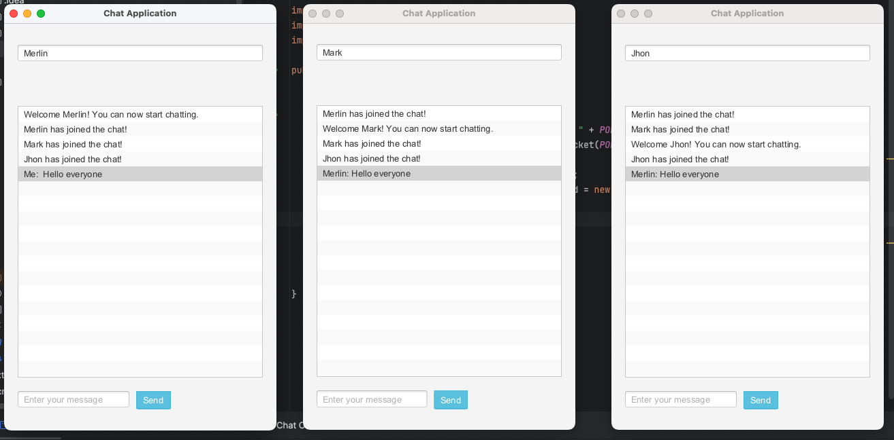
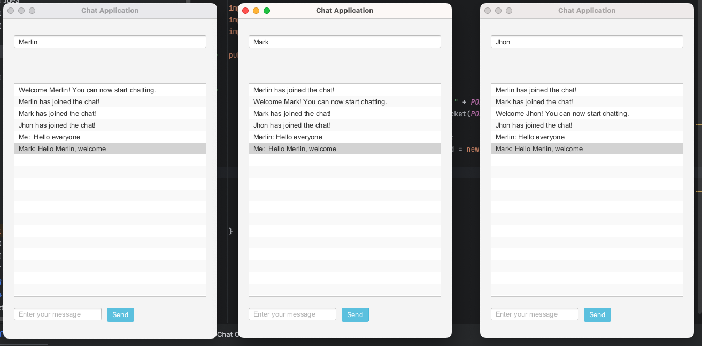
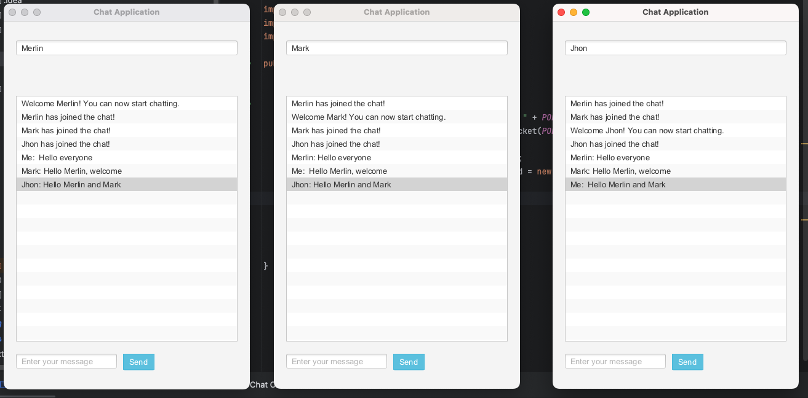

# JavaFX-BootstrapFX Chat Application with Socket and Thread

## Structure et demarrage de l'application avec 3 client connectés au serveur

## Merlin & Mark join chat

## Merlin Send Message

## Mark Reply

## Jhon Reply

